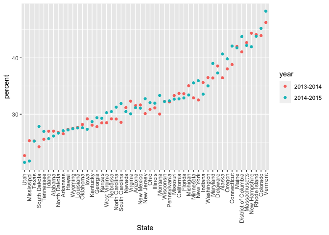

dw_II_class_2
================
Caleigh Dwyer
2023-10-17

``` r
library(rvest)
library(tidyverse)
```

    ## ── Attaching core tidyverse packages ──────────────────────── tidyverse 2.0.0 ──
    ## ✔ dplyr     1.1.3     ✔ readr     2.1.4
    ## ✔ forcats   1.0.0     ✔ stringr   1.5.0
    ## ✔ ggplot2   3.4.3     ✔ tibble    3.2.1
    ## ✔ lubridate 1.9.2     ✔ tidyr     1.3.0
    ## ✔ purrr     1.0.2     
    ## ── Conflicts ────────────────────────────────────────── tidyverse_conflicts() ──
    ## ✖ dplyr::filter()         masks stats::filter()
    ## ✖ readr::guess_encoding() masks rvest::guess_encoding()
    ## ✖ dplyr::lag()            masks stats::lag()
    ## ℹ Use the conflicted package (<http://conflicted.r-lib.org/>) to force all conflicts to become errors

``` r
library(p8105.datasets)
```

\##strings

``` r
string_vec = c("my", "name", "is", "jeff")

str_detect(string_vec, "e")
```

    ## [1] FALSE  TRUE FALSE  TRUE

``` r
##when you run the above, it tells you which of the values match your condition! You can use along with filter to find observations you want to get rid of


str(replace(string_vec, "jeff", "Jeff G"))
```

    ##  Named chr [1:5] "my" "name" "is" "jeff" "Jeff G"
    ##  - attr(*, "names")= chr [1:5] "" "" "" "" ...

``` r
string_vec = c(
  "i think we all rule for participating",
  "i think i have been caught",
  "i think this will be quite fun actually",
  "it will be fun, i think"
)

str_detect(string_vec, "i think")
```

    ## [1] TRUE TRUE TRUE TRUE

``` r
##above just finds any case that matches the words, whereas one below finds any case that starts with the match
str_detect(string_vec, "^i think")
```

    ## [1]  TRUE  TRUE  TRUE FALSE

``` r
##below finds the one where i think is in the end
str_detect(string_vec, "i think$")
```

    ## [1] FALSE FALSE FALSE  TRUE

``` r
string_vec = c(
  "Time for a Pumpkin Spice Latte!",
  "went to the #pumpkinpatch last weekend",
  "Pumpkin Pie is obviously the best pie",
  "SMASHING PUMPKINS -- LIVE IN CONCERT!!"
)

str_detect(string_vec, "[Pp]umpkin")
```

    ## [1]  TRUE  TRUE  TRUE FALSE

``` r
##above finds both upper and lower case matches
```

``` r
string_vec = c(
  '7th inning stretch',
  '1st half soon to begin. Texas won the toss',
  'she is 5 feet 4 in tall',
  '3am - cant sleep :('
)

str_detect(string_vec, "[0-9]")
```

    ## [1] TRUE TRUE TRUE TRUE

``` r
str_detect(string_vec, "^[0-9]")
```

    ## [1]  TRUE  TRUE FALSE  TRUE

``` r
str_detect(string_vec, "^[0-9][a-z]")
```

    ## [1]  TRUE  TRUE FALSE  TRUE

``` r
## you can combine conditions
```

``` r
string_vec = c(
  'Its 7:11 in the evening',
  'want to go to 7-11?',
  'my flight is AA711',
  'NetBios: scanning ip 2023.'
)

str_detect(string_vec,"7.11")
```

    ## [1]  TRUE  TRUE FALSE FALSE

``` r
##above finds any 7 11 phrase with character inbetween
```

``` r
string_vec = c(
  "[sfdjkls]",
  ":]",
  ":[",
  "I found [6-7]"
)
str_detect(string_vec, "\\[")
```

    ## [1]  TRUE FALSE  TRUE  TRUE

``` r
str_detect(string_vec, "\\[[0-9]")
```

    ## [1] FALSE FALSE FALSE  TRUE

``` r
##to find a special character, you have to use brackets to indicate what you're looking for, because otherwise str detect will interpret it functionally
##this is why people dont want you using special characters, because it's hard to detect
```

\##factors

``` r
vec_sex = c("male", "male", "female", "female")
vec_sex = factor(c("male", "male", "female", "female"))
vec_sex
```

    ## [1] male   male   female female
    ## Levels: female male

``` r
##notice differences when you run the two above. when a factor, values are no longer in "" and it indicates levels
as.numeric(vec_sex)
```

    ## [1] 2 2 1 1

``` r
vec_sex = fct_relevel(vec_sex, "male")
vec_sex
```

    ## [1] male   male   female female
    ## Levels: male female

``` r
as.numeric(vec_sex)
```

    ## [1] 1 1 2 2

``` r
##use fct_relevel to reorder factors
```

\##NSDUH

``` r
nsduh_url = "http://samhda.s3-us-gov-west-1.amazonaws.com/s3fs-public/field-uploads/2k15StateFiles/NSDUHsaeShortTermCHG2015.htm"

table_marj =
  read_html(nsduh_url) |> 
  html_table() |> 
  first() |> 
  slice(-1)
```

need to tidy this

``` r
marj_df =
  table_marj |> 
  select(-contains ("P Value")) |> 
  pivot_longer(
    -State,
    names_to = "age_year",
    values_to = "percent"
  ) |> 
  separate(age_year, into = c("age", "year"), "\\(") |> 
  mutate(year = str_replace(year, "\\)", ""),
percent = str_replace(percent, "[a-b]", ""),
percent = as.numeric(percent)) |> 
  filter(!(State %in% c("Total U.S.", "Northeast", "Midwest", "South", "West")))


##pivot longer because age and year were a column name
##now need to seaparate age and year
```

``` r
marj_df |> 
  filter(age == "18-25") |> 
  mutate(State = fct_reorder(State, percent)) |> 
  ggplot(aes(x = State, y = percent, color = year))+
  geom_point()+
  theme(axis.text.x = element_text(angle = 90, vjust = 0.5, hjust = 1))
```

<!-- -->
